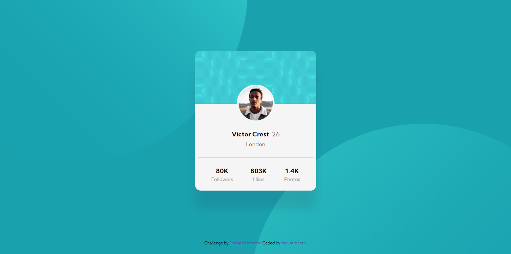
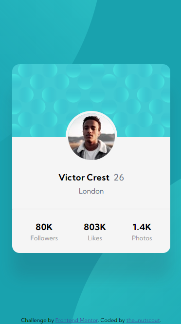

# Profile card component solution with HTML and CSS using Flexbox centering and mobile first


## Hello! 👋

Thank you for checking this solution! If you don't know what I'm talking about, this is a solution to the [Profile card component challenge on Frontend Mentor](https://www.frontendmentor.io/challenges/profile-card-component-cfArpWshJ). This is my second Front-End Mentor Challenge by now and first one that I'm starting without a tutorial so I guess that's progress (yay!)

## Table of contents

- [Overview](#overview)
  - [The challenge](#the-challenge)
  - [Screenshot](#screenshot)
  - [Links](#links)
- [My process](#my-process)
  - [Built with](#built-with)
  - [What I learned](#what-i-learned)
  - [Continued development](#continued-development)
  - [Useful resources](#useful-resources)
- [Author](#author)
- [Acknowledgments](#acknowledgments)

## Overview

### The challenge

- Build out the project to the designs provided

### Screenshot

#### Desktop:

#### Mobile:

### Links

Here you can try the live site or give me a comment!
- [Live Site](https://thenutscout.github.io/ProfileCard/)
- [Solution](https://www.frontendmentor.io/solutions/profile-card-component-solution-using-flexbox-center-and-mobile-first-mFRBIV_9R)

## My process

### Built with

- Semantic HTML5 markup
- CSS custom properties
- Flexbox
- Mobile-first workflow
- [Normalize](https://necolas.github.io/normalize.css/)
- [Kumbh Sans from Google Fonts](https://fonts.google.com/specimen/Kumbh+Sans)

### What I learned

The card part was easy for me. I really liked how everything fitted and I was really proud of me. The hard thing, again, were the backgrounds. It really caught me off guard the fact that I had to use TWO vectors for the background instead of one vector like the [Huddle landing page challenge](https://github.com/thenutscout/HuddlePage). But then I found out (thanks to a comment in a solution I checked out) that I can use the two backgrounds at the same time and that blow my mind at that moment. So I tried it and it worked!

```css 
  body{
    background-color: hsl(185, 75%, 39%);
    background-image: url("../images/bg-pattern-top.svg"), url("../images/bg-pattern-bottom.svg");
    background-repeat: no-repeat no-repeat;
    background-position-x: -765px, 130px; background-position-y: -600px, 300px;
  }
```

Also I used used `background-image` for the card and it turned out to be better that I expectd (I originally wanted to use a normal image for the card by HTMl and it didn't work well).

```css 
  .card{
    background-image: url("../images/bg-pattern-card.svg");
    background-size: 100%;
    background-repeat: no-repeat;
    background-color: whitesmoke;
    background-position: top center;
  }
```

### Continued development

Even though I liked the final result of the backgrounds in the specified dimensions of the design images, I didn't liked how it turned out out of those dimentions. For mobile there's not a big problem, but what about a bigger screen? I tried changing the units for the backgrounds x-y positions for vh, vw and even percentages but I didn't liked the result so I went back to pixels. I'm thinking the problem is not only the units but also the sizing for the background vectors so I want to check those details too.

### Useful resources

- [Yusuf's solution](https://www.frontendmentor.io/solutions/profile-card-component-zjqEBbaoe) - A big thank you for @YusufWebDev and @hire-blac !! They really helped me in the issue with the background and other things I had doubts. I could never be more gratefull for that little help from both of you!!
- [Mozilla developer](https://developer.mozilla.org/en-US/docs/Web/CSS) - This helped me searching in some css doubts that I had while working on this project. It's very complete (even helping me in other coding stuff like JS) so I recommend to check it.

## Author

By the moment my only contact that I give is my Frontend Mentor account, here you can know a little about me and check the other solutions that I will upload:

- Frontend Mentor - [@thenutscout](https://www.frontendmentor.io/profile/thenutscout)

## Acknowledgments

And here we are at the end! I really liked this challenge so I want to first thank Frontend Mentor to create this challenge. Also I want to thank Algoritmia Club GDA (Dev George) which you can check their page [here](https://www.algoritmia-gda.club) (only in spanish) and my friends Pedro and Alex, because if it wasn't by them I wouldn't be trying to know more about this world of Web Developing. At the end but not less important I want to thank **YOU** for taking the time to check this solution and read this loooooooooooooong README. I hope you like what you see and wish you a nice coding!
